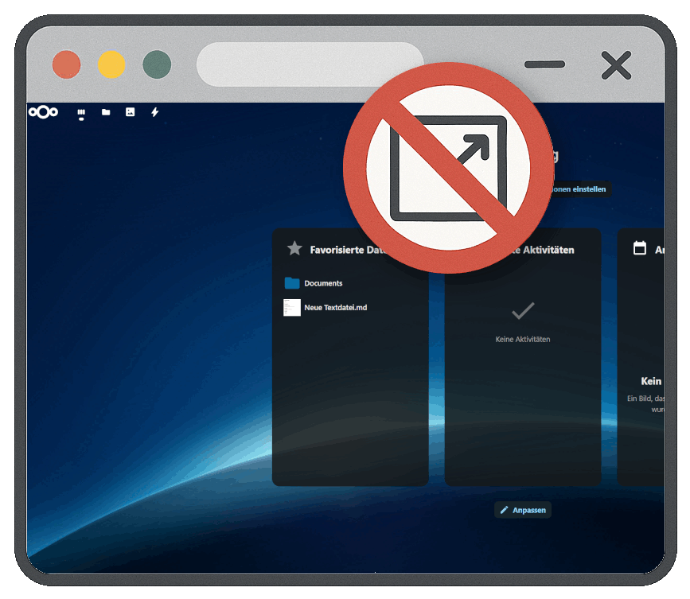

# 🔗 Same Window for Nextcloud

**Keep your Nextcloud experience seamless by preventing links from opening in new tabs**

*Enhance your workflow by staying within the current interface*

## ✨ Features

- 🔗 **Automatic Link Modification**: Removes `target="_blank"` and `target="_new"` attributes from links
- 🎯 **Widget-Only Processing**: Only affects links within content Widgets, not Navigation or Headers
- 🧠 **Smart Link Handling**: Intelligently processes only links that should be modified
- ⚡ **Dynamic Content Support**: Handles dynamically loaded content through Mutation Observers
- 🚀 **Zero Configuration**: Works immediately with no setup required
- 🔄 **Override Support**: Users can still open in new tabs with middle-click when needed

## 🛠️ How It Works

This app automatically detects links within Nextcloud dashboard widgets that would normally open in new windows/tabs and modifies them to open in the same window instead. This provides a more integrated experience by keeping users within the current Nextcloud interface.

## 👆 User Override Options

Users can still open links in new Windows/Tabs when needed by using:
- **Middle Mouse Button** click

## 🔍 Technical Details

The Same Window app uses:
- JavaScript Mutation Observers to detect dynamically loaded content
- Targeted selectors that only affect widget content areas
- Event listeners that preserve standard browser override behaviors

## 📋 Requirements

- 📦 Nextcloud 28, 29, 30 or 31

## 💜 Support Development

If you find this app useful, consider supporting this and future developments, which heavily relies on coffee:

## 📄 License

This project is licensed under the [AGPL-3.0-or-later](LICENSE) license.
